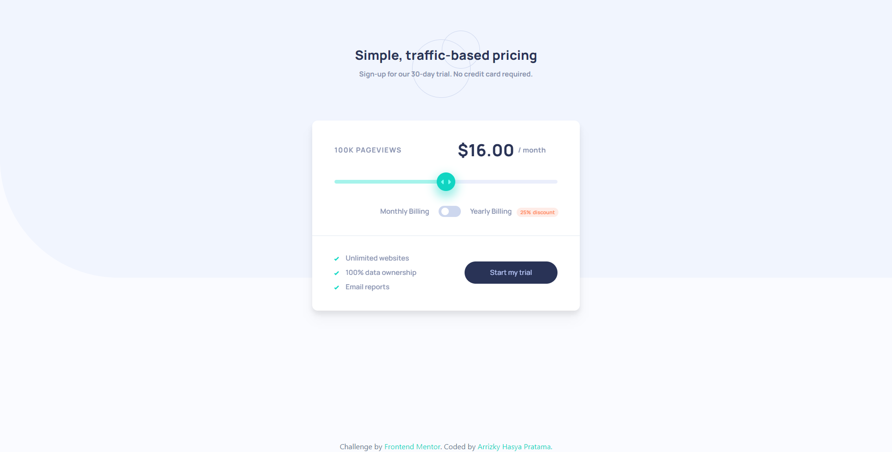

# Frontend Mentor - Interactive pricing component solution

This is a solution to the [Interactive pricing component challenge on Frontend Mentor](https://www.frontendmentor.io/challenges/interactive-pricing-component-t0m8PIyY8). Frontend Mentor challenges help you improve your coding skills by building realistic projects.

## Table of contents

- [Overview](#overview)
  - [The challenge](#the-challenge)
  - [Screenshot](#screenshot)
  - [Links](#links)
- [My process](#my-process)
  - [Built with](#built-with)
  - [What I learned](#what-i-learned)
  - [Useful resources](#useful-resources)
- [Author](#author)

## Overview

### The challenge

Users should be able to:

- View the optimal layout for the app depending on their device's screen size
- See hover states for all interactive elements on the page
- Use the slider and toggle to see prices for different page view numbers

### Screenshot

[📱 Mobile Version](./mobile.png)

### Links

- 📌 Solution URL: [Solution](https://github.com/arrizkyhp/fm-interactive-pricing-component)
- 🎪 Live Site URL: [Live Site](https://arrizkyhp.github.io/fm-interactive-pricing-component/)

## My process

### Built with

- Semantic HTML5 markup
- Flexbox
- CSS Grid
- [TailwindCss](https://tailwindcss.com/) - CSS framework
- [ReactJS](https://reactjs.org/) - JS library

### What I learned

I learned how to make slider & toggle, also if use `<section>` element make sure have `<h1>` or heading in it

### Useful resources

You can see resources here:

- [🔗 Notion Page](https://statuesque-area-df9.notion.site/Interactive-pricing-component-af6785b559c6423b9c13e297327d7572)

## Author

- Github - [arrizkyhp](https://github.com/arrizkyhp)
- Frontend Mentor - [@arrizkyhp](https://www.frontendmentor.io/profile/arrizkyhp)
- Twitter - [@arrizkyhp](https://twitter.com/arrizkyhp)
